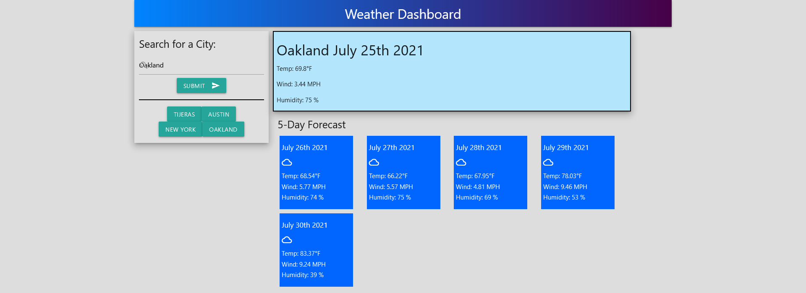

# weather-dashboard

A search engine used to obtain a 5 day forecast.

##

##

## Description

Weather Dashboard exists to help users obtain information regarding the weather in cities they select. It was created by me as a way to further my developer experience. It taught me how to interact with third party api's to obtain the information I want. To use Weather Dashboard simply load the page, enter a USA city in the search box and click submit. It's that easy! What you'll get is a report card containing today's information in it's own box. Below that you will find a five day forecast for the upcoming days. The time and dates were obtained with Moment.js. If you've never used Moment before I highly recommend that you do.

## Installation

N/A
